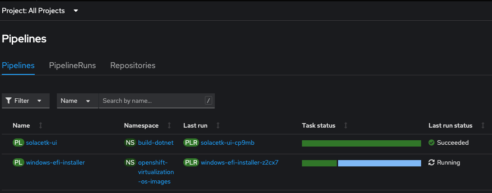
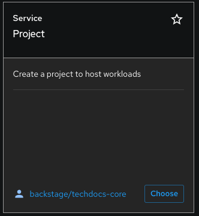
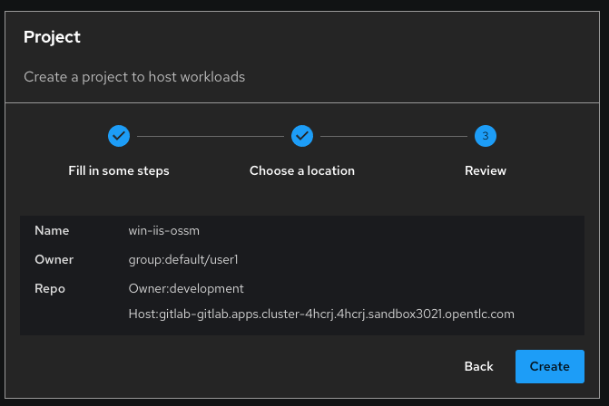
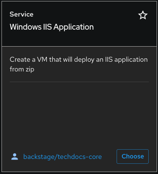
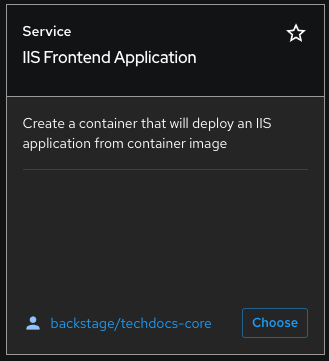
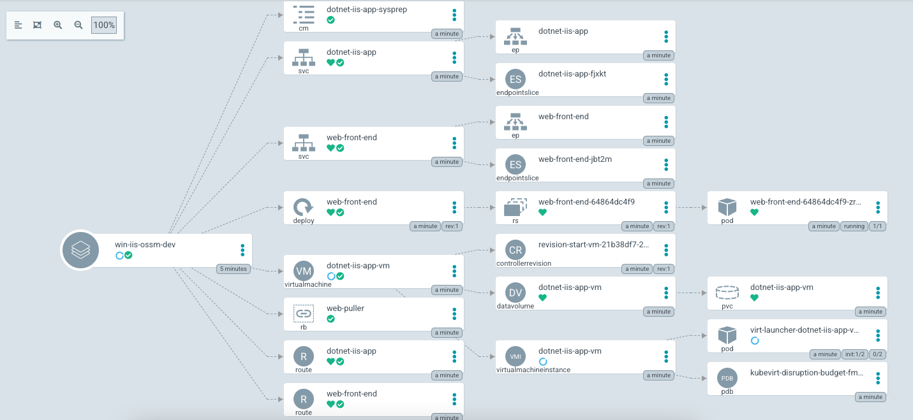
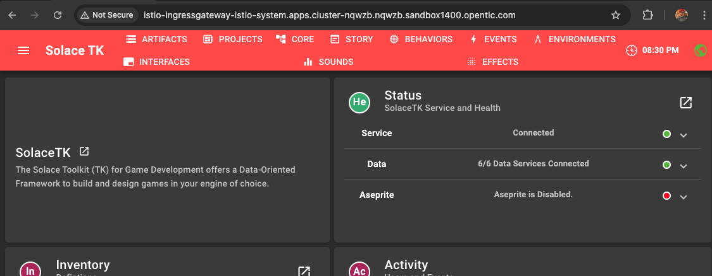
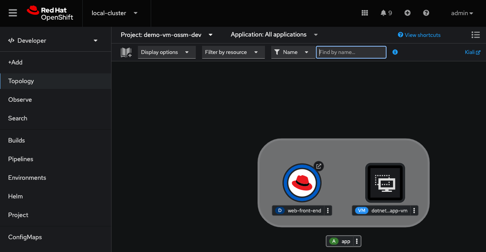
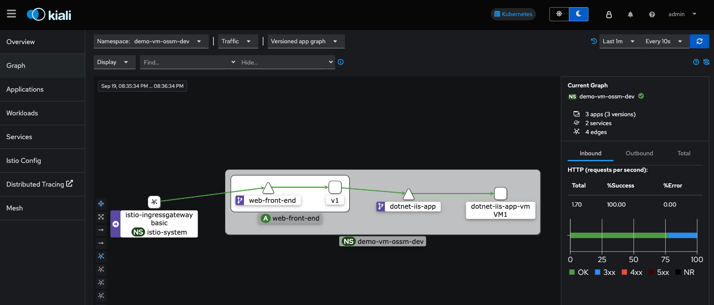

# ocp-virt-win-iis-ossm-pipeline-demo

## Instructions Overview

These are the steps needed to set up and run this demo. Detailed instructions follow:

1. Provision `Red Hat Developer Hub Demo` from Red Hat Demo Platform
2. Upload templates to RHDH and create base app images (container and VM)
3. Enable OpenShift Service Mesh Operators (multiple)
4. Create Service Mesh Control Plane (`istio-system`)
5. Use RHDH to deploy application stack
6. Validate application access

## Instructions Detail

### Provision `Red Hat Developer Hub Demo` from Red Hat Demo Platform

1. Provision the following Demo from Red Hat Demo Platform
- [Link to order demo](https://demo.redhat.com/catalog?item=babylon-catalog-prod/enterprise.red-hat-developer-hub-demo.prod)
- Once provisioned, note the URL and Password for gitlab
example (you will use this info later):
```bash
export GITLAB_HOST=gitlab-gitlab.apps.cluster-ou812.ou812.sandbox512.opentlc.com

export GITLAB_PASSWORD=MjYzMjg4
```

### Upload templates to RHDH and create base app images (container and VM)

### Prereqs
1. Ansible cli is installed on your local workstation
2. `PyYAML` python library is installed on your local workstation
3. `kubernetes` python library is installed on your local workstation
4. `typing-extension` python library is installed on your local workstation

```bash
python3.11 -m venv .venv
source .venv/bin/activate
pip install -r requirements.txt
```

### Steps

You will need to run an ansible playbook to configure the additional items that will be required for this demo.

1. Login to OpenShift cli using the provided credentials from the Developer Hub Access Demo details

```bash
Example: 

oc login -u admin -p 12345 https://api.cluster-abcd.abcd.sandbox42069.opentlc.com:6443    

Login successful.

You have access to 88 projects, the list has been suppressed. You can list all projects with 'oc projects'

Using project "default". 
```
 
2. Run the ansible playbook substituting the values for your root password from the demo.redhat.com console and the gitlab dns hostname as well
    ```bash
    cd ansible
    ansible-playbook --extra-vars "gitlab_host=${GITLAB_HOST}" --extra-vars "root_password=${GITLAB_PASSWORD}" ./create_ocp_environment.yaml
    ```

*** Note: *** Do not include `https://` in the `GITLAB_HOST` variable

This playbook will create two pinelines/pipeline runs

1. namespace `openshift-virtualization-os-images` - pipeline run `windows-efi-installer`
2. namespace `build-dotnet` - pipeline run `solacetk-ui`

Wait for these pipelineruns to complete before proceeding to the next steps.  
`windows-efi-installer` can take awhile to complete... go get some coffee... take the dog for a walk, etc...    
It took 38 minutes last time I waited for completion.



## Enable OpenShift Service Mesh Operators

*** Note: *** These steps can be completed in parallel whilst you wait for the pipelines to complete.

TODO: Automate with CR and ansible

To install `Red Hat OpenShift Service Mesh`, you must install the `Red Hat OpenShift Service Mesh Operator`. Repeat the procedure for each additional Operator you want to install.

Additional Operators include:

- `Kiali Operator provided by Red Hat`

- `Red Hat OpenShift distributed tracing platform provided by Red Hat`  
 
(Note: *Red Hat OpenShift distributed tracing* will need to be replaced with the *Tempo Operator* down the road)


## Create Service Mesh control plane

Once all the operators have been installed, run:

```bash
sh ./1-setup-mesh.sh
1. Create a namespace/project called istio-system which is where the control plane will be deployed.
project.project.openshift.io/istio-system created

2. Deploy a controle plane in istio-system
servicemeshcontrolplane.maistra.io/basic created
Ensure mesh has been successfully deployed with the following pods


# NAME                                    READY   STATUS    RESTARTS   AGE
# grafana-58d67499c4-67jhs                2/2     Running   0          108s
# istio-egressgateway-5d577ccdff-k7nbc    1/1     Running   0          108s
# istio-ingressgateway-75554d57b4-tqxmz   1/1     Running   0          108s
# istiod-basic-57dfdc6cf-9n6x6            1/1     Running   0          2m13s
# jaeger-6dbc9b8f95-tbzrg                 2/2     Running   0          105s
# kiali-cbf4cbb84-dgfsw                   1/1     Running   0          72s
# prometheus-6769665b64-6pb6g             3/3     Running   0          2m4s

^Ctrl-C 

Is kiali running?
kiali-94cc484bf-cvbg5                   1/1     Running   0          37s

Deploy ingress-gateway
gateway.networking.istio.io/demo-gateway created
```

**Note:** Be sure to check that `Kiali` has been deployed (known bug in earlier versions prevented this)

## Use RHDH to deploy application stack

This involves clicking "create" filling out three templates `Project`, `IIS Web Application` and `IIS Frontend Application` (in that order)

### Steps:

1. **Launch Developer Hub Console and create 'Project`**  


   - Log in as `user1`.
   - Click "Create" and select the `Project` catalog item.
   - Fill out the `Project` template:
     - **Component Name**: Provide a name for the new component.
     - **Owner**: Set this to `group:user1`.
     - **GitLab URL**: Enter your GitLab URL without the `https://` prefix.
     - **Development Item**: Leave this as the default value.
   - Complete the template setup.  
  
  

2. **Create IIS Web Application**:  


   - After the `Project` template is provisioned, create an `IIS Web Application` using the corresponding catalog item.
   - Keep defaults for all the steps
   - This application can take a few minutes to be up and running (15+ minutes sometimes)

3. **Create Frontend Application**:  


   - After the `IIS Web Application` template is provisioned, create an `IIS Frontend Application` using the corresponding catalog item.
   - Choose the backend you created in step 2
   - Keep defaults for IIS deployment options step


3. **Sync with ArgoCD**:  


   - Wait for ArgoCD to automatically sync, or manually trigger the sync from the ArgoCD console.

## Validate application access  

1.  Locate the new project in the OpenShift console. For instance, if the project name is `test`, you will find a `test-dev` project.

2. verify front end is up with and accessible via the `istio-ingressgateway` route - this will run even if the backend is down, but will only display red status circles. They will show up as green if the backend is up.

```bash
export GATEWAY=$(oc get route istio-ingressgateway -n istio-system -o template --template '{{ .spec.host }}')

echo $GATEWAY 
curl -o /dev/null -s -w "%{http_code}\n" $GATEWAY

```

(example output:)
```bash
istio-ingressgateway-istio-system.apps.cluster-nqwzb.nqwzb.sandbox1400.opentlc.com
200 # <- http return code
```
**Note:** If the return code is not `200`, something is not right

3. Access the front end webpage using the `$GATEWAY` URL in a browser (note: `http` not `https`)  



If the status shows green next to `Service` and `Data`, then the front end is successfully communicating with the IIS service running on the VM.

4. Check istio connectivity in Kiali

- Go to the topology view of your namespace and click the `Kiali` link in the upper right corner
  


- View the flow of traffic in the `Graph` view in Kiali
  
